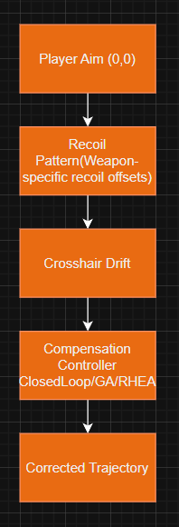
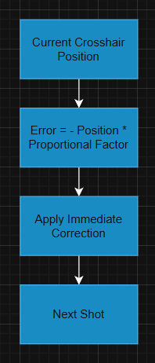
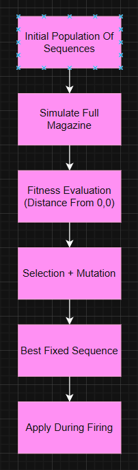
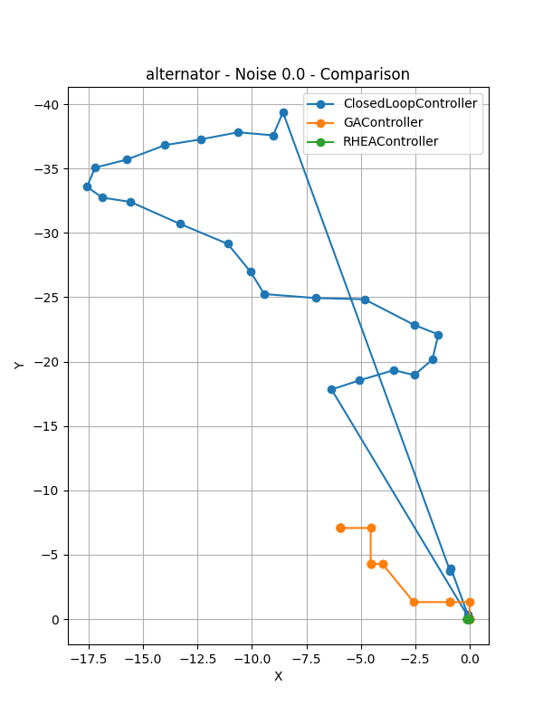
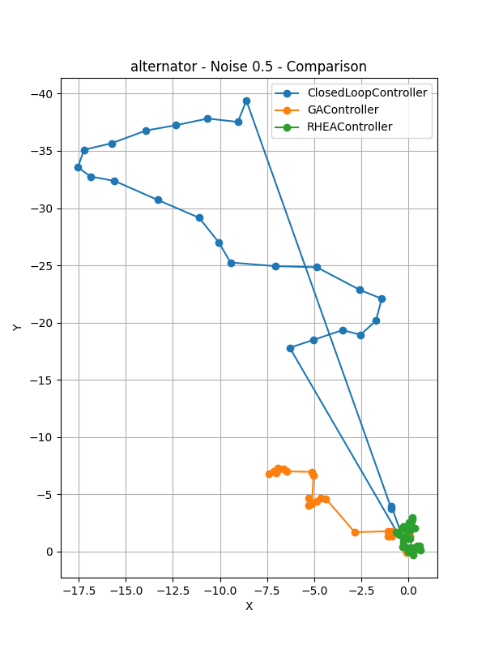
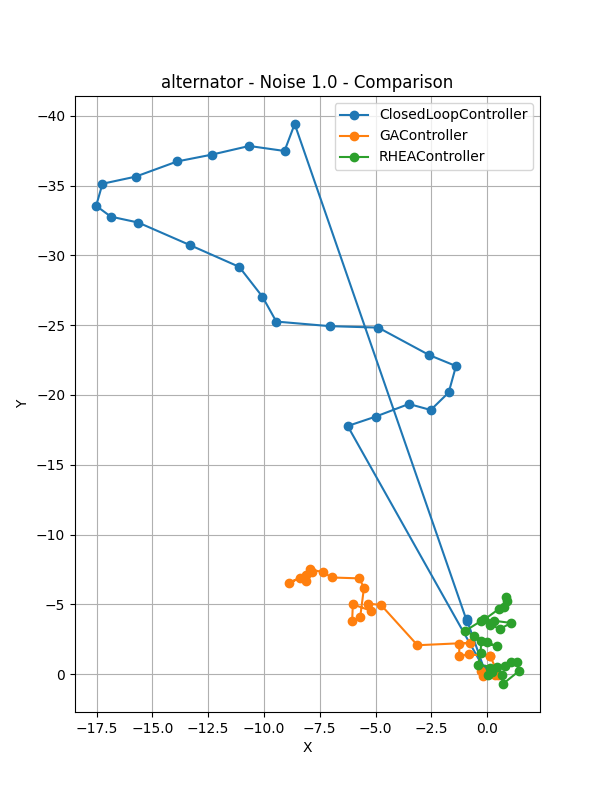
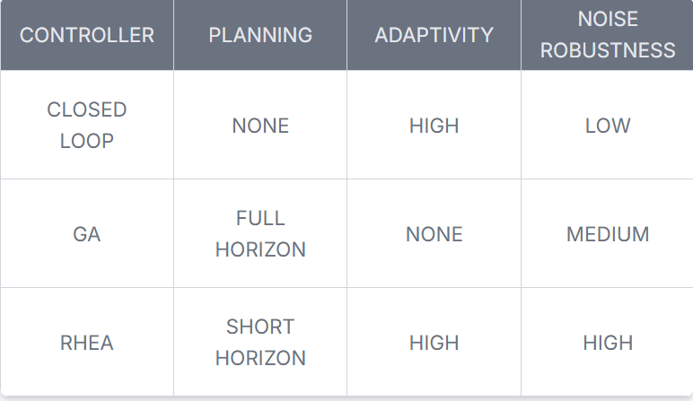

RecoilControllerComparison

# Overview
This project compares multiple control strategies for recoil smoothing using simulated Apex Legends weapon recoil patterns. Closed-loop feedback control, a Genetic Algorithm (GA), and a Rolling Horizon Evolutionary Algorithm (RHEA) are evaluated based on how effectively they keep the crosshair near the target centre (0,0) under varying noise levels.
The goal is to study control stability, accuracy, and smoothness rather than game automation and comparing the 3 controllers factoring in compute time.

## TL;DR:
This project benchmarks three control strategies—Closed-Loop (PD), Genetic Algorithm (GA), and Rolling Horizon Evolutionary Algorithm (RHEA)—for stabilizing simulated Apex Legends weapon recoil. It evaluates each controller under varying noise levels using metrics such as mean squared error, maximum deviation, and trajectory smoothness. GA produces smooth offline trajectories for deterministic recoil, while RHEA adapts online to noise with near-perfect accuracy. The project emphasizes control systems, evolutionary optimization, experimental fairness, and metric-driven evaluation, providing reproducible results and structured logging suitable for research or engineering applications.


## How To Run
```bash
git clone https://github.com/LeoSenthan/RecoilSmootherEvaluation
cd RECOILSMOOTHEREVALUATION
pip install -r requirements.txt
python scripts/run_Baselines.py
```

## Problem Overview



# Skills Practiced

- Control systems fundamentals
- Evolutionary optimization
- Experimental fairness
- Metric-driven evaluation
- Clean engineering practices


# Weapon Recoil Simulation

- Each weapon uses a predefined recoil pattern (X/Y displacement per shot)
- Recoil is applied sequentially across a magazine
- Optional Gaussian noise models human inconsistency
- The simulator tracks cursor position in pixel space

The recoil data for the weapons was originally sourced from the Apex Legends Recoil repository:
[https://github.com/metaflow/apex-recoil](https://github.com/metaflow/apex-recoil)
Thank You Very Much

## Assumptions:
- No weapon sway or burst delays
- No recoil reset between shots
- Identical recoil patterns across episodes

# Controllers Implemented

## Closed-Loop Controller



- A proportional-derivative (PD-style) feedback controller that applies compensation based on the current cursor position.
- Reacts instantly to error
- No planning or learning
- Serves as a simple baseline


## Genetic Algorithm (GA) Controller



- An offline evolutionary controller that optimizes a full compensation sequence for an entire magazine.
- Optimizes all shots simultaneously
- Uses fitness based on distance from origin and smoothness
- Evolves a population over several generations
- Uses deterministic recoil during training

## Rolling Horizon Evolutionary Algorithm (RHEA) Controller


- An online planner that re-optimizes compensation over a short horizon at every shot.
- Plans over a limited future window
- Executes only the first action of each plan
- Evaluates candidates using multiple noisy rollouts
- Trades computation time for adaptability


# Design Decisions

- Pixel-space evaluation chosen to match raw recoil data
- Smoothness penalty added to discourage jittery compensation
- Equalized evolutionary budgets to ensure fair comparison

# Mathematics

This section formalizes the control strategies used in the project: Closed-Loop (PD), Genetic Algorithm (GA), and Rolling Horizon Evolutionary Algorithm (RHEA).


## 1. Closed-Loop Controller (PD)

The controller reacts to current cursor error and smooths noise using a derivative term:


$$
\text{Action}_t = - K_p \cdot \text{Pos}_t - K_d \cdot (\text{Pos}_t - \text{Pos}_{t-1})
$$

Where:  
- $\( \text{Pos}_t \)$ = cursor position after shot $\(t\)$
- $\( \text{Pos}_{t-1} \)$ = cursor position after previous shot  
- $\( K_p \)$ = proportional gain  
- $\( K_d \)$ = derivative/smoothness gain  

> The action is applied to reduce deviation and ensure smooth movement.


## 2. Genetic Algorithm (GA) Controller

Goal: Find an optimal sequence of compensations $\(\mathbf{U} = [\mathbf{u}_1, \mathbf{u}_2, ..., \mathbf{u}_N]\)$ for a full magazine.

Position Update per Shot:
```math
\mathbf{p}_0 = [0,0], \quad
\mathbf{p}_t = \mathbf{p}_{t-1} + \mathbf{r}_t + \mathbf{u}_t
```

Where:
$\(\mathbf{r}_t\)$ = recoil displacement for shot $\(t\)$

$\(\mathbf{u}_t\)$ = compensation applied


Fitness Function:

```math
\text{Fitness}(\mathbf{U}) = \sum_{t=1}^{N} \|\mathbf{p}_t\|^2 + \lambda \sum_{t=2}^{N} \|\mathbf{p}_t - \mathbf{p}_{t-1}\|^2
```

- First term = cumulative squared deviation (accuracy)  
- Second term = smoothness penalty $(\(\lambda = \text{smoothness\_weight}\))$

Evolutionary Operators:
- Selection: Top $\(E\%\)$ genomes  
- Crossover:
```math
\mathbf{u}^{\text{child}}_t = 
\begin{cases}
\mathbf{u}^{p1}_t & \text{with probability 0.5} \\
\mathbf{u}^{p2}_t & \text{otherwise}
\end{cases}
```

- Mutation:
```math
\mathbf{u}_t \gets \mathbf{u}_t + \epsilon_t, \quad \epsilon_t \sim \mathcal{N}(0, \sigma_t^2)
```

Optimal Sequence:
```math
\mathbf{U}^* = \arg\min_{\mathbf{U}} \text{Fitness}(\mathbf{U})
```

> GA produces a smooth, near-optimal trajectory offline.

## 3. Rolling Horizon Evolutionary Algorithm (RHEA) Controller

Goal: Online planning over a short horizon \(H\); only the first action is applied each shot.

Horizon Genome:
```math
\mathbf{U}_t = [\mathbf{u}_t, \mathbf{u}_{t+1}, ..., \mathbf{u}_{t+H-1}]
```

Position Update per Rollout:
```math
\mathbf{p}_{t+i}^{(r)} = \mathbf{p}_{t+i-1}^{(r)} + \mathbf{r}_{t+i} + \mathbf{u}_{t+i}, \quad i = 0..H-1
```
Include noise if present: $\(\mathbf{r}_t \sim \mathbf{r}_t + \mathcal{N}(0, \sigma^2)\)$

Fitness per Genome:
```math
\text{Fitness}(\mathbf{U}_t) = \frac{1}{R} \sum_{r=1}^R \left[ \sum_{i=0}^{H-1} \|\mathbf{p}_{t+i}^{(r)}\|^2 + \lambda \sum_{i=1}^{H-1} \|\mathbf{p}_{t+i}^{(r)} - \mathbf{p}_{t+i-1}^{(r)}\|^2 \right]
```

Where:  
- $\(R\)$ = number of rollouts per genome  
- $\(\lambda\)$ = smoothness weight  

Action Selection:
```math
\mathbf{a}_t = \mathbf{u}_t^*, \quad \mathbf{U}_t^* = \arg\min_{\mathbf{U}_t} \text{Fitness}(\mathbf{U}_t)
```

> Only the first action $\(\mathbf{a}_t\)$ is applied; the algorithm replans at the next shot with updated position.

# Fairness & Evaluation Budget

To ensure fair comparison:
- GA and RHEA are constrained to similar evolutionary effort
- Population size × generations are matched
- Noise conditions are identical across controllers
- Multiple episodes are averaged per configuration

This avoids favoring online or offline methods unfairly.

# Metrics Collected

For each controller, weapon, and noise level:

- Mean Squared Error (MSE) from (0,0)
- Maximum Deviation during firing
- Trajectory Smoothness (sum of squared deltas)
- Mean Trajectory across episodes

All metrics are saved as structured JSON logs.
This allows direct comparison across controllers, weapons, and noise settings.

## Results & Logging Structure
```
results/
├── plots/
│   └── <weapon>/<noise>/<controller>.png
└── logs/
    └── <controller>/<weapon>/noise_<level>.json
```


# Visualization

- Mean recoil trajectories plotted per controller
- Y-axis inverted to match screen coordinates
- Identical scaling for fair visual comparison

# Key Findings

## Quantitative Comparison (Alternator)

| Controller | Noise σ | MSE ↓ | Max Deviation ↓ | Smoothness ↓ | Relative Compute Cost |
|------------|---------|-------|-----------------|--------------|-----------------------|
| Closed Loop|   0.0   | 843.83|      40.29      |    1781.51   |       Very Low        |
|     GA     |   0.0   | 39.66 |       9.24      |     26.18    |        Medium         |
|    RHEA    |   0.0   | 0.0059|       0.11      |    0.0009    |         High          |
| Closed Loop|   1.0   | 843.47|      40.35      |    1781.54   |       Very Low        |
|     GA     |   1.0   | 51.79 |      11.03      |     34.74    |        Medium         |
|    RHEA    |   1.0   | 8.63  |       5.59      |     13.62    |         High          |

## Compute Cost Analysis

Average wall-clock runtime per magazine was measured over 10 runs (alternator, σ = 0.0).

| Controller        | Avg Runtime (ms) | Std (ms) | Relative Cost |
| ----------------- | ---------------- | -------- | ------------- |
| Closed Loop       |   1.75           | ±0.64    | Very Low      |
| GA (incl. evolve) |   360.62         | ±34.51   | Medium        |
| RHEA              |   4721.27        | ±388.31  | High          |

-Closed-loop control runs in ~1.7 ms, making it effectively real-time.
-GA requires ~361 ms per magazine (offline feasible).
-RHEA requires ~4.7 seconds, making it ~13× slower than GA and unsuitable for real-time execution under current settings.

The higher cost of RHEA stems from:
-Re-optimizing at every shot
-Planning over a future horizon
-Evaluating multiple noisy rollouts per candidate

This quantifies the core trade-off explored in this project:

Accuracy and robustness increase with computational effort.

Under typical real-time constraints (~16.6 ms per frame at 60 FPS), only the closed-loop controller is immediately deployable without further optimization.




With no noise (σ = 0.0), RHEA dramatically outperforms both baselines.  
Compared to closed-loop control, RHEA reduces MSE by **over 99.99%** and maximum deviation by **~350×**, while producing an almost perfectly smooth trajectory.

GA achieves strong performance under deterministic recoil, reducing MSE by **~95%** relative to closed-loop control, but remains an order of magnitude less accurate than RHEA.




At moderate noise (σ = 0.5), closed-loop control remains largely unaffected due to its reactive nature but continues to exhibit large sustained deviation.

GA shows a modest degradation in accuracy and smoothness, while RHEA maintains robust performance, achieving a **~99.7% lower MSE** than closed-loop control and a **~45% reduction** compared to GA.



Under high noise (σ = 1.0), RHEA continues to outperform both alternatives despite performance degradation.  
While GA experiences increasing deviation due to its offline nature, RHEA maintains a **~6× lower MSE** and **~2× lower maximum deviation**, demonstrating superior robustness to uncertainty.



- Closed-loop control is stable but struggles with sustained recoil.
- GA produces smooth, near-optimal trajectories for deterministic recoil.
- RHEA adapts better to noise but is computationally expensive.

# Limitations

- No human reaction delay
- Deterministic recoil during GA training
- Simplified physics model
- Assumes fire rate is constant.

# Conclusion

- Offline optimization excels in predictable environments.
- Online planning improves robustness under uncertainty.
- Smoothness penalties significantly affect perceived stability.
- Evaluation budget matters more than algorithm choice.

# Extensions

- Shared evaluation budget framework
- Real-time constraints benchmarking
- Additional recoil models

# Requirements

Minimal dependencies:
- numpy
- matplotlib

# Disclaimer
It is designed as a learning and research project, not for gameplay automation.

# Credits
The recoil data for the weapons was originally sourced from the Apex Legends Recoil repository by metaflow:
[https://github.com/metaflow/apex-recoil](https://github.com/metaflow/apex-recoil)
Thank You Very Much
